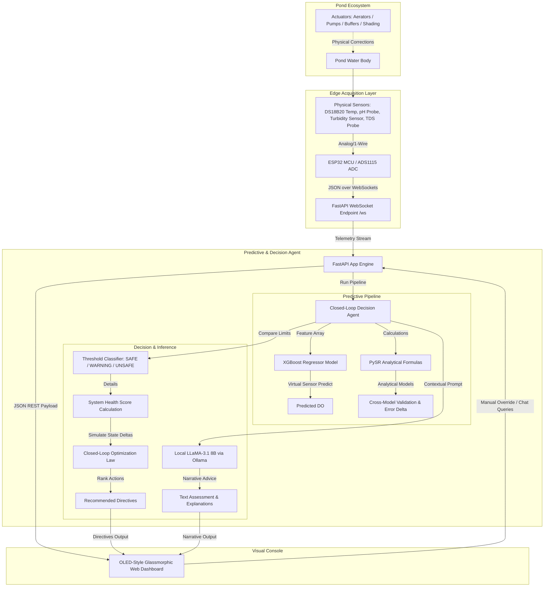
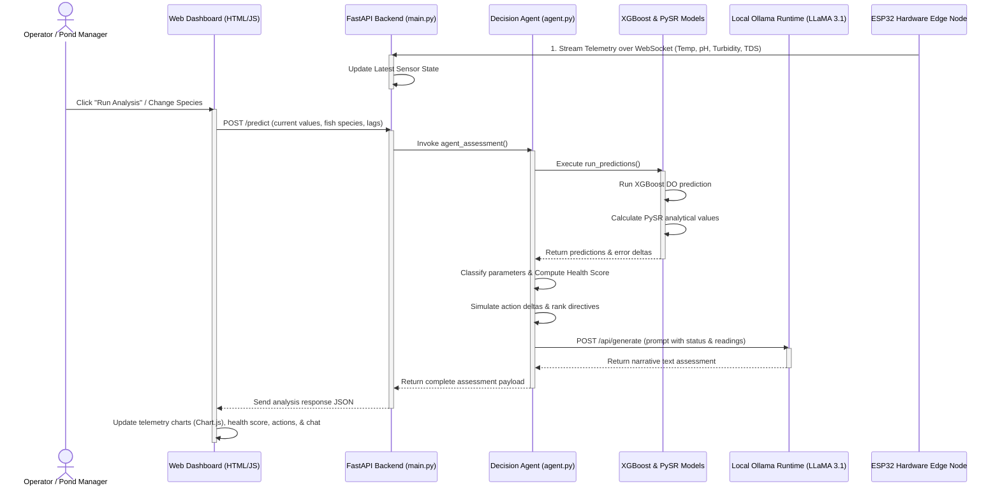

# A Hybrid Machine Learning and Symbolic Regression-Based Cyber-Physical System for In-Situ Water Quality Monitoring, Autonomous Decision Control, and Generative AI Diagnostics in Precision Aquaculture
### *An Intelligent Closed-Loop Aquaculture Decision-Support System with Hybrid ML/Symbolic Predictors and Local Generative AI Diagnostics*

---

## 1. Abstract & System Overview

This repository contains the complete design, software implementation, and hardware firmware for this **Hybrid Machine Learning and Symbolic Regression-Based Cyber-Physical System for In-Situ Water Quality Monitoring, Autonomous Decision Control, and Generative AI Diagnostics in Precision Aquaculture**. 

Aquaculture environments are highly dynamic biological systems where dissolved oxygen depletion, sudden pH swings, or organic pollution (TDS, turbidity) can cause catastrophic crop loss. Traditional water monitoring systems are passive—measuring variables without predicting future states or recommending optimal closed-loop corrective actions.

**This system** addresses these limitations by introducing a three-layer cyber-physical framework:
1. **Edge Acquisition Node**: An ESP32-based microcontroller that samples physical telemetry (Temperature, pH, Turbidity, TDS) and streams real-time JSON packets over high-throughput WebSockets.
2. **Dual-Model Predictive Core**: A hybrid prediction engine that uses an **XGBoost Regressor** to predict Dissolved Oxygen (DO) (acting as a "virtual sensor" to replace expensive chemical probes) and compares it against **PySR (Symbolic Regression)** analytical equations for real-time mathematical validation.
3. **Closed-Loop Agentic Control Layer**: A decision agent that calculates an overall Water Body Health Score, simulates the impact of candidate physical interventions, ranks them using a delta-improvement utility function, and calls a local **LLaMA 3.1 8B LLM** (via Ollama) to output narrative diagnostics and power an interactive agent chat.

---

## 2. System Architecture & Data Flow

The flow of telemetry and feedback follows a strict cyber-physical loop, outlined in the architecture and sequence diagrams below.

### 2.1 Cyber-Physical Architecture Diagram



### 2.2 Sequence Diagram of the Run Loop



---

## 3. Hardware Sensor Ingestion & Mechanical Layer

### 3.1 Edge Node Sensor Integration
The physical sensing edge node is driven by an **ESP32-WROOM-32** (ESP32 DevKitC v4 development board) microcontroller programmed in C++ (`Arduino part/sketch_may11a/sketch_may11a.ino`) and powered by two **18650 lithium-ion battery cells**. It acquires four key water quality parameters using researched, calibrated in-situ sensors:

*   **Temperature ($T_C$)**: Captured using a waterproof **DS18B20 digital temperature probe** (encased in a corrosion-resistant stainless steel capsule) connected to a 1-Wire bus with an adapter module.
*   **pH Level ($pH$)**: Sampled using an Analog Glass Bulb pH Electrode probe (**E-201-C** BNC electrode) interfaced via a **PH-4502C** pH sensor adapter board and connected to an **ADS1115** 16-bit analog-to-digital converter (ADC) via an $I^2C$ bus. Temperature compensation is applied at the edge:
    $$pH_{\text{compensated}} = 7.0 + \frac{2.5 - V_{\text{pH}}}{0.18} - 0.03 \times (T_C - 25.0)$$
*   **Total Dissolved Solids ($TDS$)**: Acquired using a Water Conductivity Analog TDS Sensor Module **SEN0244** (comprising the TDS Meter V1.0 signal transmitter board and a waterproof two-needle TDS probe) connected to the ADS1115 (channel 0) to minimize noise. Temperature compensation adjusts the raw reading:
    $$V_{\text{TDS}} = V_{\text{raw}} \times \frac{0.1875}{1000}$$
    $$TDS_{\text{raw}} = 133.42 \times V_{\text{TDS}}^3 - 255.86 \times V_{\text{TDS}}^2 + 857.39 \times V_{\text{TDS}}$$
    $$TDS_{\text{compensated}} = \frac{TDS_{\text{raw}}}{1.0 + 0.02 \times (T_C - 25.0)} \times 0.5$$
*   **Turbidity ($Tu$)**: Sampled via an Analog Turbidity Sensor Module **SEN0189** (comprising the **TS-300B** photo-interrupter turbidity sensor probe and the adapter driver board with a blue calibration potentiometer) on GPIO 35. The ADC reading is converted to voltage and mapped to Nephelometric Turbidity Units (NTU):
    $$V_{\text{turb}} = \text{analogRead}(35) \times \frac{3.3}{4095}$$
    $$Turbidity_{\text{NTU}} = -434.78 \times V_{\text{turb}} + 1434.78$$

The ESP32 constructs a JSON document containing the sensor values and transmits it over WebSockets every **5 seconds** to the host IP running FastAPI.

### 3.2 Floating Autonomous Buoy Enclosure (Mechanical Design & Cross-Section)
To enable autonomous, long-term in-situ deployment, the edge hardware components (ESP32 microcontroller, dual 18650 Li-ion battery cells, ADS1115 ADC, and sensor adapter PCBs) are housed within a custom **cylindrical floating buoy enclosure**.

*   **Ridged Screw-On Jar Lid**: The cylinder is capped at the top with a ridged, screw-on jar-like lid. This mechanical cap allows operators to easily open and close the buoy for maintenance (e.g., swapping the 18650 batteries or reprogramming the ESP32) while ensuring a watertight seal when closed.
*   **Internal Watertight Compartment**: The upper section of the cylinder forms the dry chamber, securely housing the ESP32 MCU, dual 18650 battery pack, and the ADS1115 converter, with all PCBs clean-wired and protected from moisture.
*   **External pH Probe Mounting**: The glass bulb pH electrode probe (E-201-C BNC electrode) is mounted externally on the side of the cylinder. It hangs in the water body to allow quick calibration and electrode replacement without opening the main dry compartment.
*   **Bottom Sensor Array**: The remaining three sensors extend downwards from the bottom of the cylinder into the water column:
    *   The waterproof **DS18B20 temperature probe** (steel capsule).
    *   The **TS-300B turbidity probe** (featuring its signature transparent double-pronged fork chamber).
    *   The **SEN0244 TDS probe** (comprising a white cylindrical collar ending in two parallel exposed metal pins/needles).
*   **Hermetic Bottom Seals**: The bottom exit holes for the temperature, turbidity, and TDS probes are sealed hermetically with waterproof **pipe sealant** (silicone/epoxy) to prevent water ingress into the internal electronics.

Below is the physical unit (Figure 1a) and its corresponding cross-sectional engineering diagram (Figure 1b):


*Figure 1a: Physical floating autonomous buoy enclosure housing the sensor PCBs and battery pack.*


*Figure 1b: Cross-sectional engineering schematic showing the dry chamber layout with the screw cap, external pH probe mounting, bottom-mounted sensors (double-pronged turbidity fork and two-pin TDS probe), and pipe-sealant hermetic seals.*

---

## 4. Dual-Model Predictive Pipeline

The primary predictive task is determining **Dissolved Oxygen (DO)** without using expensive optical or galvanic DO probes. This system uses a hybrid mathematical approach.

### 4.1 XGBoost Regressor (Virtual Sensor)
A machine learning regression model is trained on a master aquaculture dataset containing **74,758 rows** of empirical water measurements.
*   **Features**: $[Temp, pH, Turbidity, TDS]$
*   **Target**: $DO$
*   **Model Configuration**: XGBoost Regressor with 400 estimators, max depth of 6, learning rate of 0.05, and CPU histogram tree method.
*   **Performance**: Achieves a Root Mean Squared Error (RMSE) of **$\approx 1.056$ mg/L** on unseen test data.

### 4.2 Symbolic Regression (PySR) Analytical Formulations
To validate the black-box machine learning model, PySR (Python Symbolic Regression) was run on the dataset to discover the underlying mathematical structures governing the parameters. These equations run concurrently with XGBoost.

#### 4.2.1 Time-Independent Predictions ($t=0$, raw static inputs)
*   **Dissolved Oxygen ($DO$)**:
    $$DO = \left[\left(pH \times \left(T_C \times 0.094597\right) + 56.2161\right) + \frac{T_C \times \left(90.7455 - T_C\right) - \sqrt{Tu}}{-46.414} + pH\right] - \left(\ln(pH) \times 17.3931\right)$$
    *Statistical Performance: RMSE = 4.702 mg/L*
*   **Temperature ($T_C$)**:
    $$T_C = \frac{(Tu - 44.441) \times (pH - Tu)}{pH + \frac{TDS}{-3.224} - 56.712} + 34.466 - pH$$
    *Statistical Performance: RMSE = 5.760 °C*
*   **pH**:
    $$pH = \left[\left(\left(Tu \times -0.04218\right) + \left(TDS + \frac{-0.26138}{\sqrt{Tu}} \times (T_C + 12.056)\right)\right) \times 0.9996\right] + 9.974 - TDS$$
    *Statistical Performance: RMSE = 1.069*
*   **Turbidity ($Tu$)**:
    $$Tu = \left(TDS \times 0.00617\right) + \frac{0.63438}{\ln\left(\ln\left(\frac{pH}{1.5489}\right)\right)} - 17.726 + \frac{316.676}{T_C - 5.100} + T_C$$
    *Statistical Performance: RMSE = 11.469 NTU*
*   **Total Dissolved Solids ($TDS$)**:
    $$TDS = \left(T_C \times \left(T_C - 49.562\right) + 1104.126\right) + Tu - T_C$$
    *Statistical Performance: RMSE = 413.47 ppm*

#### 4.2.2 Time-Dependent Predictions ($t+1$, utilizing lag values)
If a previous state ($Lag_1$) is available, the symbolic models incorporate temporal dynamics:
*   **Dissolved Oxygen ($DO_{t+1}$)**:
    $$DO_{t+1} = \left(\sqrt{T_C} + \sqrt{T_C}\right) + \left(DO_{\text{lag}} + pH - 25.7979\right) + \frac{\left(DO_{\text{lag}} \times -0.115\right) \times \left(DO_{\text{lag}} \times pH\right) + 371.178}{T_C + 3.4585}$$
*   **Temperature ($T_{C, t+1}$)**:
    $$T_{C, t+1} = \left(T_{C, \text{lag}} \times -0.218\right) + pH \times \ln\left(\ln\left(\ln\left(T_{C, \text{lag}} - \ln\left(Tu\right)\right)\right)\right) \times \left(\frac{-22.217}{\ln(T_{C, \text{lag}})} + 1.477\right)$$
*   **pH ($pH_{t+1}$)**:
    $$pH_{t+1} = \left(\left(\left(pH_{\text{lag}} \times \frac{Tu}{T_C}\right) + T_C\right) \times -0.0474\right) + 11.380 - \frac{4.925}{Tu} - \frac{18.979}{pH_{\text{lag}}}$$
*   **Turbidity ($Tu_{t+1}$)**:
    $$Tu_{t+1} = \frac{TDS}{200.665} + \frac{226.473}{\ln(T_C)} + \left(Tu_{\text{lag}} \times \frac{\frac{Tu_{\text{lag}} - 37.931}{200.717}}{0.788}\right) + T_C - 68.302$$
*   **Total Dissolved Solids ($TDS_{t+1}$)**:
    $$TDS_{t+1} = \left(Tu + 280.189\right) - \left(TDS_{\text{lag}} \times -0.286\right) - \left(T_C \times -1.601\right)$$

### 4.3 Error Delta & Validation
The system calculates the absolute difference between the ML output (XGBoost) and the analytical formula output:
$$\text{Error Delta } |\Delta_p| = |Value_{\text{ML}} - Value_{\text{Formula}}|$$
Significant deviations in $|\Delta_p|$ indicate sensor calibration drift, severe chemical imbalance, or anomalies that warrant closer investigation.

---

## 5. Closed-Loop Agentic Control Law

When telemetry indicates water quality parameters are outside safe ranges, the agent does not merely trigger alerts; it runs a closed-loop control law to determine the optimal sequence of interventions.

### 5.1 System Health Scoring
Let $P = \{\text{Temp}, \text{pH}, \text{DO}, \text{Turbidity}, \text{TDS}\}$ represent the parameters. For each parameter $p \in P$, its current state is classified:
$$L(p) \in \{\text{SAFE}, \text{WARNING}, \text{UNSAFE}\}$$
The overall **Health Score ($H$)** is a penalized index initialized at 100:
$$H = \max\left(0, 100 - \sum_{p \in P} w(L(p))\right)$$
Where the penalty weights are:
$$w(L(p)) = \begin{cases} 
0 & \text{if } L(p) = \text{SAFE} \\
10 & \text{if } L(p) = \text{WARNING} \\
25 & \text{if } L(p) = \text{UNSAFE}
\end{cases}$$

An overall status of **UNSAFE** is declared if any single parameter is classified as `UNSAFE` or if three or more parameters are marked as `WARNING`.

### 5.2 Control Intervention Optimization
The system has a catalog of physical actions ($A$) that apply a delta response vector $\vec{\Delta}_A$ to the water state:
$$\vec{S}_{t+1} = \vec{S}_t + \vec{\Delta}_A$$

| Recommended Action ($A$) | Target Parameter | Effect Delta ($\vec{\Delta}_A$) |
| :--- | :---: | :---: |
| **Partial Water Exchange (Temp Corrective)** | Temperature | $-4.0\,^\circ\text{C}$ |
| **Emergency Aeration** | Dissolved Oxygen | $+2.0\,\text{mg/L}$ |
| **Mechanical Filtration & Sediment Removal** | Turbidity | $-12.0\,\text{NTU}$ |
| **Large Water Exchange (Dilution)** | TDS | $-150.0\,\text{ppm}$ |
| **pH Buffering (Lime Addition)** | pH | $+0.5$ |

The agent optimizes corrective actions using a **greedy health utility improvement function**:
1. It simulates applying each candidate action $A$ to the current state vector $\vec{S}_t$.
2. It calculates the resulting hypothetical health score $H(\vec{S}_t + \vec{\Delta}_A)$.
3. It computes the marginal utility: $\Delta H_A = H(\vec{S}_t + \vec{\Delta}_A) - H(\vec{S}_t)$.
4. It filters and ranks the actions in descending order of $\Delta H_A$ (only suggesting actions where $\Delta H_A > 0$).

---

## 6. Multi-Species Physiological Tolerances

Safe and warning bounds are dynamically loaded based on the target culture species. This ensures that a pH or temperature that is warning-level for cold-water Salmon is recognized as optimal for warm-water Tilapia.

| Species | State | Temp (°C) | pH | DO (mg/L) | Turbidity (NTU) | TDS (ppm) |
| :--- | :--- | :---: | :---: | :---: | :---: | :---: |
| **Tilapia** | **SAFE** <br> **WARNING** | $[25.0, 30.0]$ <br> $[20.0, 35.0]$ | $[7.0, 8.5]$ <br> $[6.0, 9.0]$ | $[4.0, 12.0]$ <br> $[3.0, 15.0]$ | $[20.0, 50.0]$ <br> $[10.0, 80.0]$ | $[200, 800]$ <br> $[100, 1000]$ |
| **Catfish** | **SAFE** <br> **WARNING** | $[24.0, 30.0]$ <br> $[20.0, 34.0]$ | $[6.5, 8.5]$ <br> $[6.0, 9.0]$ | $[3.0, 10.0]$ <br> $[2.0, 14.0]$ | $[30.0, 80.0]$ <br> $[15.0, 120.0]$ | $[150, 600]$ <br> $[100, 900]$ |
| **Salmon** | **SAFE** <br> **WARNING** | $[12.0, 16.0]$ <br> $[8.0, 18.0]$ | $[6.5, 8.0]$ <br> $[6.0, 8.5]$ | $[7.0, 14.0]$ <br> $[5.0, 16.0]$ | $[0.0, 25.0]$ <br> $[0.0, 50.0]$ | $[100, 400]$ <br> $[50, 600]$ |
| **Shrimp** | **SAFE** <br> **WARNING** | $[23.0, 30.0]$ <br> $[20.0, 32.0]$ | $[7.5, 8.5]$ <br> $[7.0, 9.0]$ | $[5.0, 10.0]$ <br> $[4.0, 12.0]$ | $[20.0, 40.0]$ <br> $[10.0, 60.0]$ | $[500, 1500]$ <br> $[300, 2000]$ |
| **Carp** | **SAFE** <br> **WARNING** | $[20.0, 28.0]$ <br> $[15.0, 32.0]$ | $[6.5, 8.5]$ <br> $[6.0, 9.0]$ | $[4.0, 12.0]$ <br> $[3.0, 15.0]$ | $[20.0, 60.0]$ <br> $[10.0, 100.0]$ | $[200, 1000]$ <br> $[100, 1500]$ |

---

## 7. Interactive Generative AI Console

To provide human-interpretable diagnostics, the agent integrates a local LLM running via **Ollama**.

*   **Model**: `llama3.1:8b-instruct-q4_K_M` (~4.7 GB GGUF)
*   **Prompt Construction**: 
    The agent formats a detailed context string listing the active species, current telemetry, classification levels, and predicted error deltas. It instructs LLaMA to write a 1-2 sentence explanation of what the current status means for the fish, followed by a bulleted checklist of recommended interventions.
*   **Interactive Chat Console**:
    Users can converse directly with the LLaMA agent from the dashboard (e.g., asking *"Why is my TDS rising?"* or *"Explain how turbidity impacts Tilapia respiration"*). The FastAPI server intercepts these requests and routes them to Ollama at `http://localhost:11434/api/generate` with a system prompt optimized for water chemistry diagnostics.

---

## 8. Project File Directory

```text
├── CPSS/                        # Cyber-Physical System Implementation
│   ├── Arduino part/            # ESP32 C++ firmware (Wi-Fi, WebSockets, sensors)
│   ├── agent/                   # Decision agent logic & Ollama AI bridge
│   ├── app/                     # FastAPI backend & Web dashboard (HTML/JS/CSS)
│   ├── data/                    # Aquaculture training dataset
│   ├── model/                   # XGBoost model training and serialized file
│   └── package.json             # Tailwind/CSS UI dependencies
├── PySR/                        # Symbolic Regression Analysis Pipeline
│   ├── PySR_Formulas_Aquaculture.ipynb # Jupyter notebook for PySR extraction
│   ├── extract_formulas.py      # Scripts to parse generated PySR formulas
│   └── outputs/                 # Raw PySR mathematical models output
└── README.md                    # This technical specification
```

---

## 9. Environment Setup & Configuration

Follow these steps to configure a local test or deployment host machine:

### 9.1 Software Dependencies
Ensure the following software is installed on the host machine:
*   **Python (v3.10 or v3.11)**
*   **Node.js (v18 or later)**
*   **Ollama Local LLM Engine**

### 9.2 Python Virtual Environment Setup
Clone the repository and open a terminal inside the project root:
```bash
# 1. Create virtual environment
python -m venv .venv

# 2. Activate virtual environment
# On Windows PowerShell:
.venv\Scripts\Activate.ps1
# On macOS/Linux:
source .venv/bin/activate

# 3. Install required libraries
pip install fastapi "uvicorn[standard]" pydantic pandas numpy scikit-learn xgboost joblib requests
```

### 9.3 Local LLM Installation
1. Start Ollama on your computer.
2. Pull the required LLaMA 3.1 instruct model:
   ```bash
   ollama pull llama3.1:8b-instruct-q4_K_M
   ```
3. Keep Ollama running in the background. It exposes its API at `http://localhost:11434`.

### 9.4 ESP32 Hardware Calibration
1. Open the [Arduino IDE](https://www.arduino.cc/en/software).
2. Install the **ESP32 board package** (by Espressif) under Boards Manager.
3. Install the required Arduino libraries via Library Manager:
   *   `WebSockets` by Markus Sattler
   *   `ArduinoJson` by Benoit Blanchon
   *   `OneWire` by Paul Stoffregen
   *   `DallasTemperature` by Miles Burton
   *   `Adafruit ADS1X15` by Adafruit
4. Open the firmware sketch at `Arduino part/sketch_may11a/sketch_may11a.ino`.
5. Update your local Wi-Fi credentials:
   ```cpp
   const char* ssid     = "YOUR_SSID";
   const char* password = "YOUR_PASSWORD";
   ```
6. Find your computer's local IP address (e.g., run `ipconfig` on Windows or `ifconfig` on Linux) and update the host IP in the sketch:
   ```cpp
   const char* FRIEND_PC_IP = "192.168.1.XX"; // Your PC's Local IP
   ```
7. Flash the code to your ESP32 board.

---

## 10. Operation Guide

### 10.1 Starting the System
1. Verify Ollama is running:
   Navigate to `http://localhost:11434` in your browser. It should display *"Ollama is running"*.
2. Activate your virtual environment and start the FastAPI server:
   ```bash
   uvicorn app.main:app --host 0.0.0.0 --port 8000 --reload
   ```
3. Access the web dashboard by navigating to:
   ```
   http://localhost:8000
   ```
4. Power on the ESP32 edge node. The Serial Monitor will output connection updates. Once connected, the dashboard's **SYSTEM LIVE** badge will turn green, and the sensor fields will populate with real-time readings every 5 seconds.

### 10.2 Retraining the XGBoost Model (Optional)
If you modify the training dataset at `data/Aquaculture_Master_Dataset_with_TDS.csv`, you can retrain the model and save the updated pickle serialization:
```bash
python model/train_xgboost.py
```

---

## 11. Dashboard Preview & Console Output

Below are screenshots demonstrating the OLED-inspired dashboard, real-time telemetry charts (comparing ML predictions vs. Symbolic regressions), and the interactive Generative AI chat console:


*Figure 2: The system console showing real-time water health scoring, sensor telemetry, active species tolerances, and recommended directives.*


*Figure 3: Real-time charts detailing the predictive comparison between the XGBoost ML model and PySR symbolic regression equations, alongside the interactive LLaMA 3.1 LLM chat assistant.*

---

## 12. Academic Citation & Reference
If you build upon this system, adapt the codebase, or reference the mathematical formulas in an academic publication or project report, please cite this project as follows:

```bibtex
@misc{aquaculture_cps_hybrid_2026,
  author       = {Mrityunjay.V, Vishal.B, Pavithran.P, Sanjit.K.R},
  title        = {A Hybrid Machine Learning and Symbolic Regression-Based Cyber-Physical System for In-Situ Water Quality Monitoring, Autonomous Decision Control, and Generative AI Diagnostics in Precision Aquaculture},
  year         = {2026},
  howpublished = {\url{https://github.com/floppa-png/Smart-Aquaculture-Management-System}},
  note         = {GitHub Repository}
}
```
